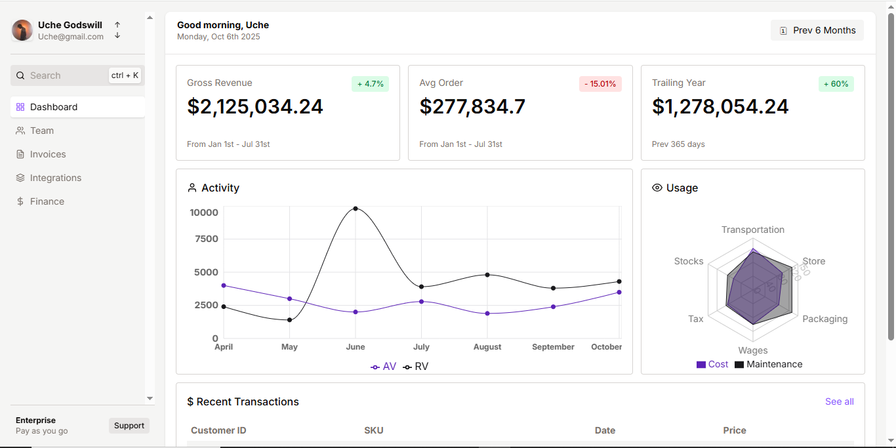

# Demo Dashboard

A basic dashboard built with **Next.js** showcasing some clean and modern UI visuals, inspired by a YouTube tutorial. This project focuses on layout and presentation, using charts, fonts, and a command menu to give it a sleek dashboard feel.

 Just visuals, no routing or backend logic.

---

## Tech Stack

- **Next.js** – React framework for building the UI  
- **Recharts** – For rendering simple, interactive graphs  
- **React Font-Icons** – For custom Icons 
- **cmdk** – Command menu interface (like a Search bar)

---

## Preview



---

## Notes
This is a demo project, mainly focused on learning and experimenting with UI tools.

Based on a tutorial from YouTube.

No multiple pages, backend, or advanced state management, just a solid frontend layout.

---

## Getting Started

Clone the repo and run it locally:

```bash
git clone https://github.com/Uche-arch/demo-dashboard.git
cd demo-dashboard
npm install
npm run dev
```

---

## Happy Coding


